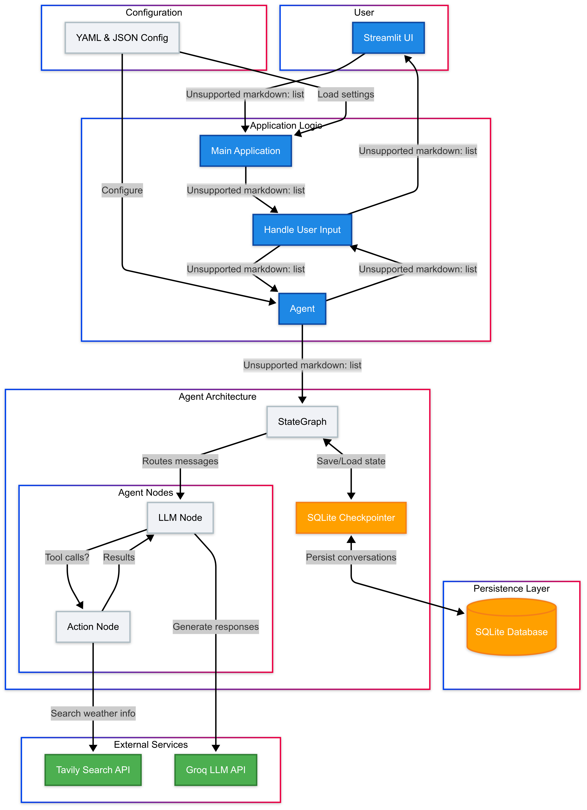

# My Building of Weather App With State Management for Long-Running Conversations

This project demonstrates how to build an AI assistant that can have long-running conversations with state management. The assistant can look up weather information and remember previous interactions across sessions.

## Features

- 🧠 **Long-term memory**: Conversations persist across sessions
- 🔍 **Search integration**: Uses Tavily to look up real-time information
- 🌐 **LLM integration**: Powered by Groq's Llama-3.3-70b model
- 📊 **Streamlit UI**: Clean, responsive user interface
- 📝 **Structured codebase**: Professional project organization


## TL;DR
I built an app that uses multiple AI agents (Security Architect, Risk Analyst, and Compliance Officer) to automatically review security proposals from different perspectives. The agents discuss the proposal together and generate a comprehensive security report. The code shows how to orchestrate multiple agents, manage their conversation, and present their findings through a clean web interface.

## Introduction:
Ever been stuck waiting for the security team to review your project? Or maybe you’re on that security team, drowning in review requests? I built a system that uses AI agents to speed up cybersecurity risk assessments. The agents work together like a real security team — each with their own expertise and perspective — to provide comprehensive reviews in minutes instead of days.

## What’s This Article About?
This article walks through building an AI-powered security review system. I’ve created a Streamlit application where users can submit security proposals for analysis. Behind the scenes, a team of specialized AI agents works together to assess the proposal:

 - A Security Architect examines technical vulnerabilities and suggests controls
 - A Risk Analyst evaluates business impacts and quantifies potential losses
 - A Compliance Officer checks for regulatory adherence to standards like GDPR and HIPAA

These agents have a structured conversation, challenge each other’s perspectives, and ultimately produce a comprehensive security recommendation. The application then formats this into a downloadable report that summarizes their findings.

Full Article : [https://medium.com/@learn-simplified/My-Building-of-Weather-App-With-State-Management-for-Long-Running-Conversations-6fd2e8be9056

## Tech Stack

| **Category**   | **Technology**                | **Purpose**                          |
|----------------|-------------------------------|--------------------------------------|
| Framework      | Streamlit                     | Web interface and UI components      |
| AI Graph       | LangGraph                     | Stateful agent architecture          |
| LLM Service    | Groq (Llama-3.3-70b)          | Natural language processing          |
| Database       | SQLite                        | Conversation persistence             |
| Search API     | Tavily                        | Real-time information lookup         |
| Configuration  | YAML, JSON                    | Application and model settings       |
| Environment    | python-dotenv                 | API key management                   |
| Language       | Python                        | Core application logic               |
| Persistence    | langgraph-checkpoint-sqlite   | State management for conversations   |


## Closing Thoughts
The future of AI assistants lies in creating more persistent, context-aware experiences. As large language models continue to improve, we'll see AI assistants that can maintain conversations across days or weeks, remember user preferences, and integrate seamlessly with more data sources and tools. 

Businesses that adopt these technologies early will gain significant advantages in customer engagement and operational efficiency. The next evolution will likely include multimodal interactions (combining text, voice, and visuals) and even more sophisticated reasoning capabilities. By understanding the fundamentals of state management shown in this article, you're preparing for this AI-powered future.


## Architecture




# Tutorial: My Building of Weather App With State Management for Long-Running Conversations

## Prerequisites
- Python installed on your system.
- A basic understanding of virtual environments and command-line tools.

## Steps

1. **Virtual Environment Setup:**
   - Create a dedicated virtual environment for our project:
   
     ```bash
     python -m venv My-Building-of-Weather-App-With-State-Management-for-Long-Running-Conversations
     ```
   - Activate the environment:
   
     - Windows:
       ```bash
          My-Building-of-Weather-App-With-State-Management-for-Long-Running-Conversations\Scripts\activate        
       ```
     - Unix/macOS:
       ```bash
       source My-Building-of-Weather-App-With-State-Management-for-Long-Running-Conversations/bin/activate
       ```
   

# Installation and Setup Guide

**Install Project Dependencies:**

Follow these steps to set up and run the  "My Building of Weather App With State Management for Long-Running Conversations"

1. Navigate to your project directory:
   ```
   cd path/to/your/project
   ```
   This ensures you're in the correct location for the subsequent steps.

2. Install the required dependencies:
   ```
   pip install -r requirements.txt   
   ```
   This command installs all the necessary Python packages listed in the requirements.txt file.


Run - Hands-On Guide: My Building of Weather App With State Management for Long-Running Conversations
  
   ```
   streamlit run main.py
   ```
   


